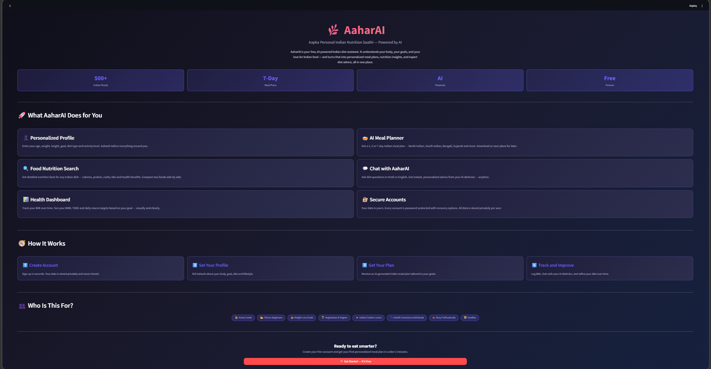
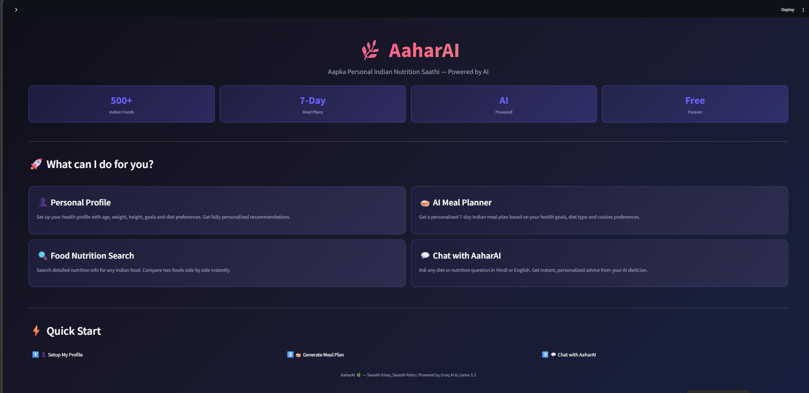
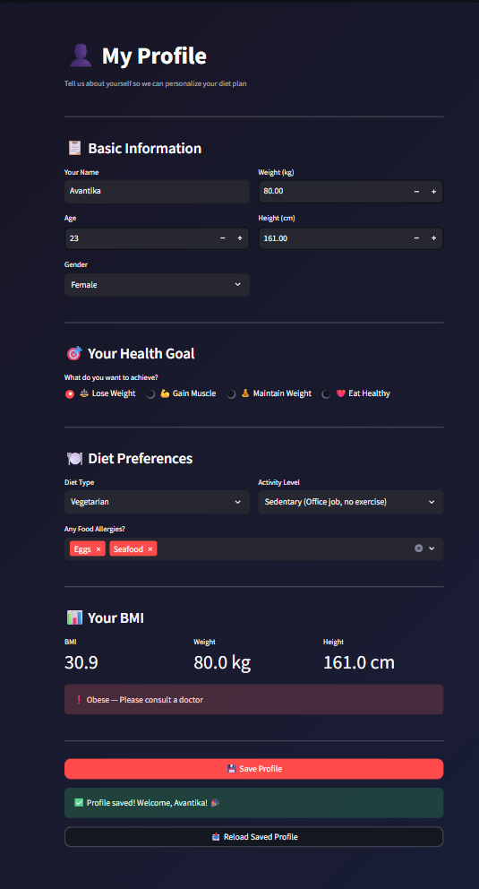
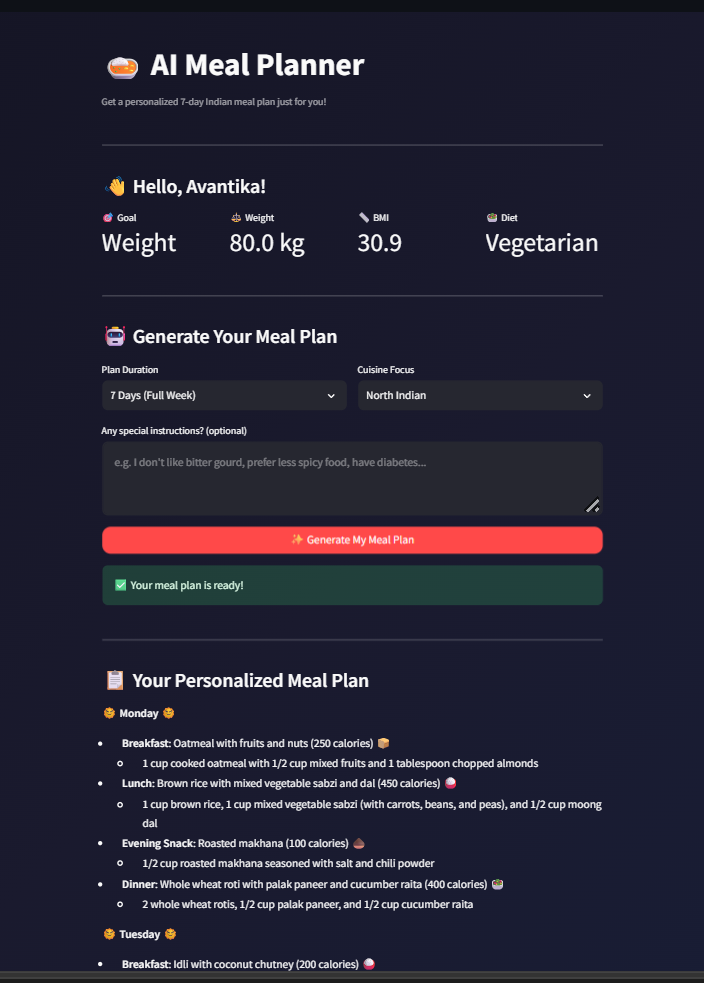
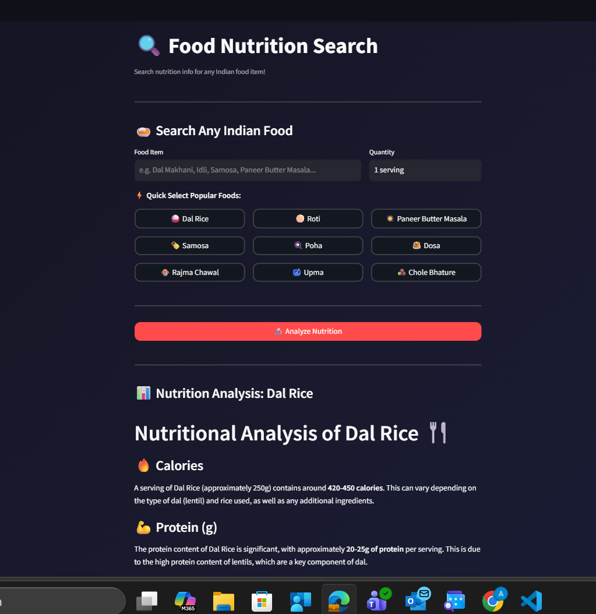
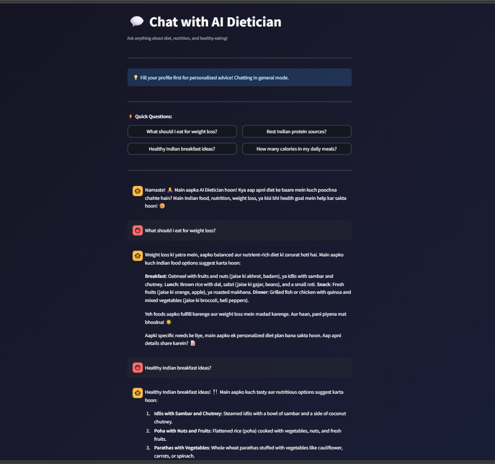
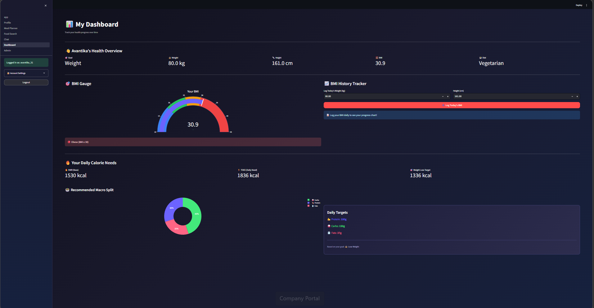
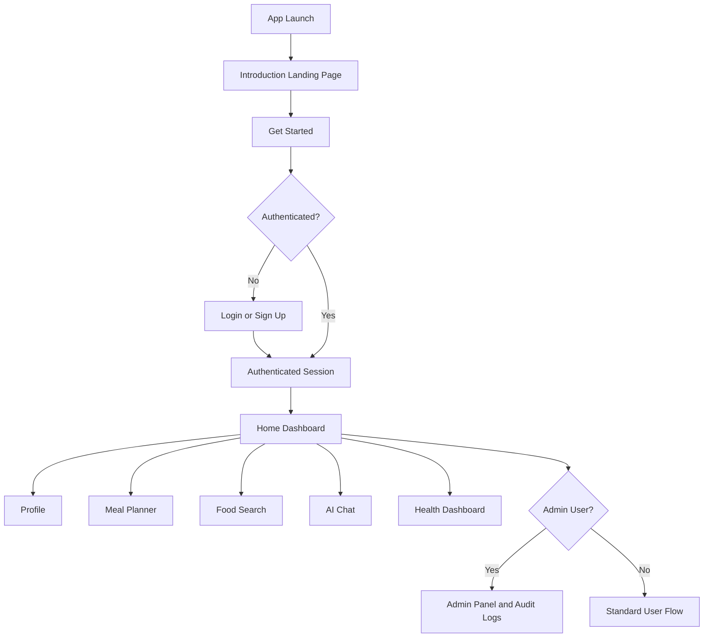

# AaharAI: AI Dietician for Indian Nutrition

AaharAI is a Streamlit application for personalized Indian diet planning. It provides a public introduction landing page, user authentication, profile-based recommendations, meal planning, nutrition lookup, AI chat assistance, progress tracking, and admin-level auditing.

## Screenshots

### Landing Page


### Home Dashboard


### Profile Setup


### AI Meal Planner


### Food Nutrition Search


### AI Dietician Chat


### Health Dashboard


## Implemented Features (Current Project Scope)

### Launch Experience and Navigation

- Intro landing page appears first on app launch (before login)
- Clear product overview, feature highlights, and onboarding steps
- Get Started CTA routes users to login/signup
- Authenticated users go directly to their app dashboard

### Authentication and Account Management

- Signup and login with password hashing (bcrypt)
- Forgot password flow using recovery answer
- Password update from account settings
- Two-step permanent account deletion with confirmation phrase
- Session-aware logout and per-user state reset

### User Profile and Personalization

- Profile form with name, age, gender, weight, height
- Goal selection, diet type, activity level, allergies
- Real-time BMI calculation and category feedback
- Profile persistence and reload capability

### AI Meal Planner

- AI-generated meal plan with plan duration options (1/3/7 days)
- Cuisine focus selection and custom notes
- Plan download as text file
- Saved plan history (timestamped) with quick preview

### Food Nutrition Search

- Nutrition analysis for custom food and quantity
- Popular Indian food quick-select buttons
- Side-by-side comparison with another food

### AI Dietician Chat

- Persistent chat history per user
- Quick question shortcuts
- Chat export to text file
- Manual chat snapshots saved with metadata

### Dashboard and Tracking

- BMI gauge chart and category indicators
- BMI history logging and trend visualization
- BMR, TDEE, and goal-adjusted calorie target
- Macro split chart with daily macro targets

### Admin and Audit System

- Admin-only panel with user metrics summary
- User listing and non-admin account deletion workflow
- Audit logs for auth/admin actions
- Audit log filters (action/status/actor/target/date/keyword)
- Presets: Today, Last 7 Days, Last 24 Hours, Failed Only
- Pagination and filtered CSV export
- Active and archived audit retention controls

### UI and Data Layer

- Shared app theme and mobile-friendly layout adjustments
- Safe JSON persistence helpers
- Per-user data buckets for profile, chat, meal plans, BMI history

## Tech Stack

- Streamlit
- Groq API (Llama 3.3)
- Plotly
- Pandas
- Requests
- python-dotenv
- bcrypt
- JSON file persistence

## Repository Structure

```text
AI-Dietician_Project/
|-- app.py
|-- requirements.txt
|-- env.example
|-- .gitignore
|-- assets/
|   |-- screenshots/
|   |   |-- landing_page.png
|   |   |-- home.png
|   |   |-- profile.png
|   |   |-- meal-planner.png
|   |   |-- food-search.png
|   |   |-- chat.png
|   |   |-- dashboard.png
|-- pages/
|   |-- 1_Profile.py
|   |-- 2_Meal_Planner.py
|   |-- 3_Food_Search.py
|   |-- 4_Chat.py
|   |-- 5_Dashboard.py
|   |-- 6_Admin.py
|-- tests/
|   |-- test_auth.py
|   |-- test_storage.py
|-- utils/
|   |-- __init__.py
|   |-- auth.py
|   |-- storage.py
|   |-- ui.py
|   |-- groq_helper.py
|   |-- gemini_helper.py
|-- data/
```

## Environment Variables

Copy env.example to .env and set values.

| Variable | Required | Purpose |
|---|---|---|
| GROQ_API_KEY | Yes | Required for meal planner, nutrition analysis, and chat |
| AAHARAI_ADMIN_USERS | Yes | Comma-separated admin usernames (example: admin,owner) |
| AAHARAI_AUDIT_ACTIVE_LIMIT | No | Max active audit log records before rollover |
| AAHARAI_AUDIT_ARCHIVE_LIMIT | No | Max archived audit log records retained |

## Local Setup

1. Create and activate a virtual environment.
2. Install dependencies.
3. Create .env from env.example.
4. Run the app.

```bash
pip install -r requirements.txt
streamlit run app.py
```

After opening the app, you will see the AaharAI introduction page first. Click Get Started to open login/signup.

## User Journey



## Test Suite

Baseline unit tests are included for core auth and storage logic.

```bash
python -m unittest discover -s tests -v
```

## Deployment (Streamlit Cloud)

1. Push repository to GitHub.
2. Create new app in Streamlit Cloud.
3. Set entrypoint to app.py.
4. Add environment values in Streamlit Secrets.
5. Deploy and run smoke tests.

### Post-Deployment Smoke Test

- Sign up and log in
- Create or reload profile
- Generate and download a meal plan
- Run nutrition search and comparison
- Send chat prompt and export chat
- Log BMI and verify charts on dashboard
- Open admin panel and verify audit filters/export

## Troubleshooting

- If AI output fails, check GROQ_API_KEY in environment/secrets.
- If admin page is inaccessible, confirm the logged-in username exists in AAHARAI_ADMIN_USERS.
- If old session data appears after user switch, logout and login again to refresh scoped state.

## License

MIT